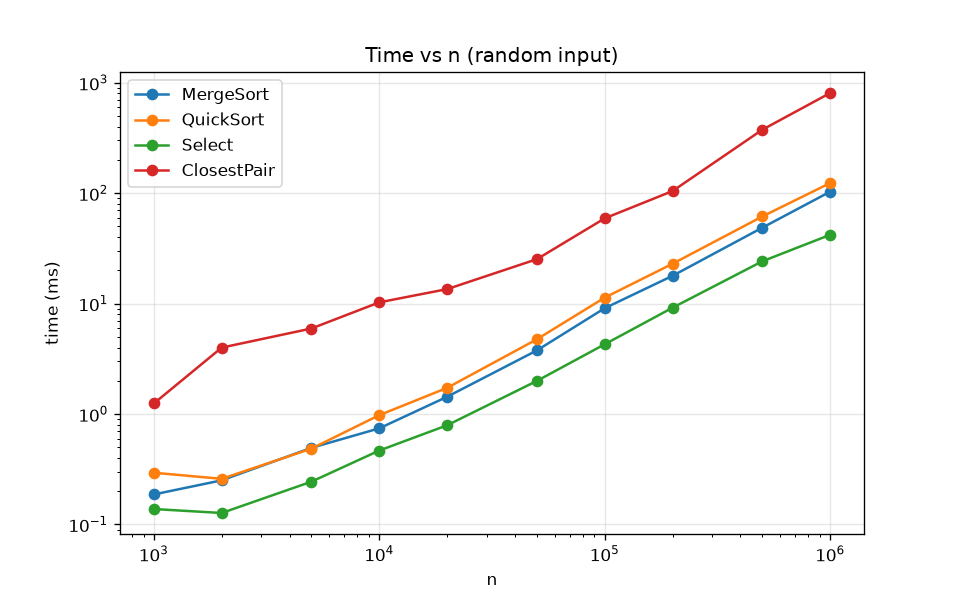
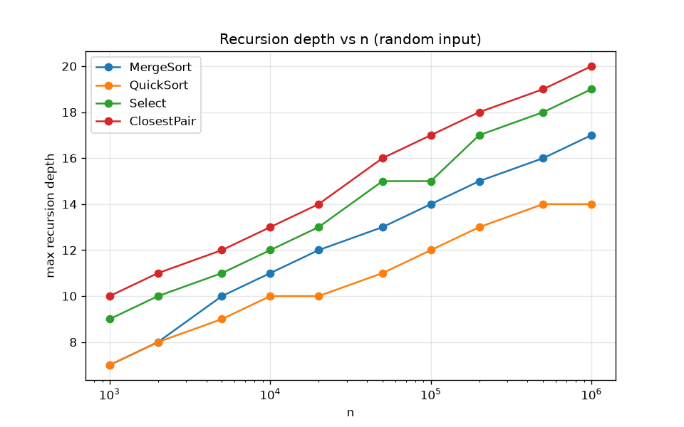
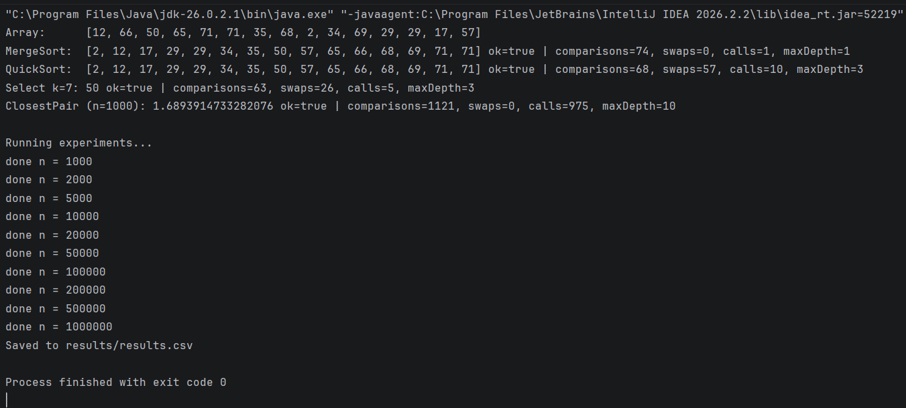
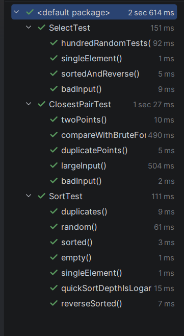

# Assignment 1: Divide-and-Conquer Algorithms

## A. Project Overview

In this assignment I implemented four divide-and-conquer algorithms in Java, analyzed their recurrences
and compared the theory with real measurements (time, recursion depth, comparisons).

Algorithms:
1. **MergeSort** – linear merge, one reusable buffer, insertion sort for small parts (n ≤ 16)
2. **QuickSort** – random pivot, in-place 3-way partition, recursion into the smaller part
3. **Deterministic Select** – Median-of-Medians, groups of 5
4. **Closest Pair of Points** – sort by x, recursive split, strip check

How to run:
```
mvn test                      # run tests
mvn compile exec:java         # demo + experiments -> results/results.csv
python docs/plot_results.py   # build plots
```

## B. Algorithm Analysis

### MergeSort
Split the array in half, sort both halves recursively, merge them in linear time.
The buffer is created once and reused. Small parts are sorted with insertion sort.

- T(n) = 2T(n/2) + Θ(n)
- Master Theorem case 2 → **Θ(n log n)**

### QuickSort
Random pivot, the array is split into `< pivot`, `= pivot`, `> pivot`.
Recursion goes into the smaller part, the larger part is handled by a loop.

- Average: T(n) = 2T(n/2) + Θ(n) → **Θ(n log n)**
- Worst case: T(n) = T(n − 1) + Θ(n) → **O(n²)** (very unlikely with a random pivot)
- Recursion depth: **O(log n)**

### Deterministic Select (Median-of-Medians)
Groups of 5 → median of each group → median of medians as pivot → partition →
recurse only into the side that contains k.

- The pivot removes at least ~30% of elements each time
- T(n) ≤ T(n/5) + T(7n/10) + Θ(n)
- n/5 + 7n/10 = 9n/10 < n → the work decreases geometrically (Akra–Bazzi) → **Θ(n)**

### Closest Pair of Points
Sort by x, solve left and right halves, d = min(dLeft, dRight).
Check the strip |x − mid| < d in y order: each point is compared with at most 7 neighbours.

- T(n) = 2T(n/2) + Θ(n) → **Θ(n log n)**
- Brute force: **Θ(n²)**

## C. Experimental Results

Time measured with `System.nanoTime()`: 10 warm-up runs, then the median of 5 runs.
Sizes 1 000 – 1 000 000. Inputs: random, sorted, reverse, duplicates (values 0–9).
All data: `results/results.csv`.

Computer: Intel Core i7-7700HQ, 16 GB RAM, Windows 11, Java 26.0.2.1 (Java HotSpot 64-Bit Server VM)

### Time (ms), random input

| n | MergeSort | QuickSort | Select | ClosestPair | BruteForce |
|---:|---:|---:|---:|---:|---:|
| 1000 | 0.187 | 0.294 | 0.138 | 1.246 | 1.875 |
| 2000 | 0.251 | 0.259 | 0.127 | 3.994 | 8.884 |
| 5000 | 0.494 | 0.486 | 0.244 | 5.948 | 28.535 |
| 10000 | 0.742 | 0.977 | 0.467 | 10.265 | 101.207 |
| 20000 | 1.433 | 1.726 | 0.791 | 13.524 | 394.035 |
| 50000 | 3.766 | 4.751 | 1.994 | 25.234 | — |
| 100000 | 9.083 | 11.330 | 4.282 | 59.148 | — |
| 200000 | 17.853 | 22.950 | 9.182 | 104.527 | — |
| 500000 | 48.696 | 61.494 | 24.152 | 375.313 | — |
| 1000000 | 103.136 | 123.528 | 41.968 | 807.069 | — |

### Recursion depth, random input

| n | MergeSort | QuickSort | Select | ClosestPair |
|---:|---:|---:|---:|---:|
| 1000 | 7 | 7 | 9 | 10 |
| 2000 | 8 | 8 | 10 | 11 |
| 5000 | 10 | 9 | 11 | 12 |
| 10000 | 11 | 10 | 12 | 13 |
| 20000 | 12 | 10 | 13 | 14 |
| 50000 | 13 | 11 | 15 | 16 |
| 100000 | 14 | 12 | 15 | 17 |
| 200000 | 15 | 13 | 17 | 18 |
| 500000 | 16 | 14 | 18 | 19 |
| 1000000 | 17 | 14 | 19 | 20 |

### Different inputs, n = 1 000 000 (time in ms)

| Input | MergeSort | QuickSort | Select | QuickSort depth |
|---|---:|---:|---:|---:|
| random | 103.136 | 123.528 | 41.968 | 14 |
| sorted | 29.833 | 78.388 | 24.048 | 14 |
| reverse | 41.734 | 78.919 | 24.987 | 15 |
| duplicates | 53.456 | 15.358 | 19.717 | 3 |

### Plots





## D. Discussion

**Do the results match theory?**
Yes, for large n. When n doubles (500 000 → 1 000 000), MergeSort and QuickSort time grows about 2 times
(n log n), Select is the fastest because it does not sort the whole array. Brute force grows about
4 times when n doubles (101 ms → 394 ms), which is n². For small n the times are noisy because of the JVM.

**How does input structure affect performance?**
Sorted and reverse arrays are faster than random ones (MergeSort: 30 ms sorted vs 103 ms random).
QuickSort does not get worse on sorted input because the pivot is random.
With many duplicates QuickSort is much faster (15 ms vs 124 ms) because the 3-way partition
puts all elements equal to the pivot in the middle and does not touch them again.

**Why does smaller-first recursion help QuickSort?**
The recursive call always gets at most half of the elements, the larger part is processed in a loop.
So the stack depth is at most log2(n) + 1. In my tests the depth was at most 15 for n = 1 000 000.

**Why does Median-of-Medians guarantee O(n)?**
The median of medians is always a good pivot: at least 30% of elements are on each side.
So every step throws away at least 30% of the array and the total work is n + 0.9n + 0.81n + … ≤ 10n.

**Why is Closest Pair faster than O(n²)?**
Brute force checks all pairs (200 million pairs for n = 20 000). Divide and conquer only checks
a few neighbours in the strip. For n = 20 000 it took 13.5 ms vs 394 ms for brute force.

**Practical factors**
- JIT: first runs are slow, so warm-up is needed and small n are noisy
- Garbage collector: can pause a measurement, so the median is used
- Cache: QuickSort and Select work in place on `int[]`, Closest Pair uses `Point` objects, so it is slower

## E. Reflection

The hardest part for me was recursion. It is easy to get confused when one recursive call goes inside
another, like in MergeSort: the array is split again and again, and it is not always clear which part
is being sorted at the moment and when the merge happens. Drawing the calls for a small array on paper
helped me understand the order in which they run.

I also saw that the theory really matches the measurements: MergeSort and QuickSort grow like n log n,
Select grows linearly, and brute force Closest Pair becomes very slow for large n. Small details matter
a lot too: the 3-way partition made QuickSort much faster on arrays with duplicates, and recursion into
the smaller part kept the recursion depth small.

## F. Screenshots

Program output:



Tests:



Results:


